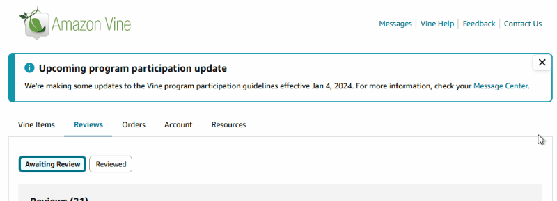
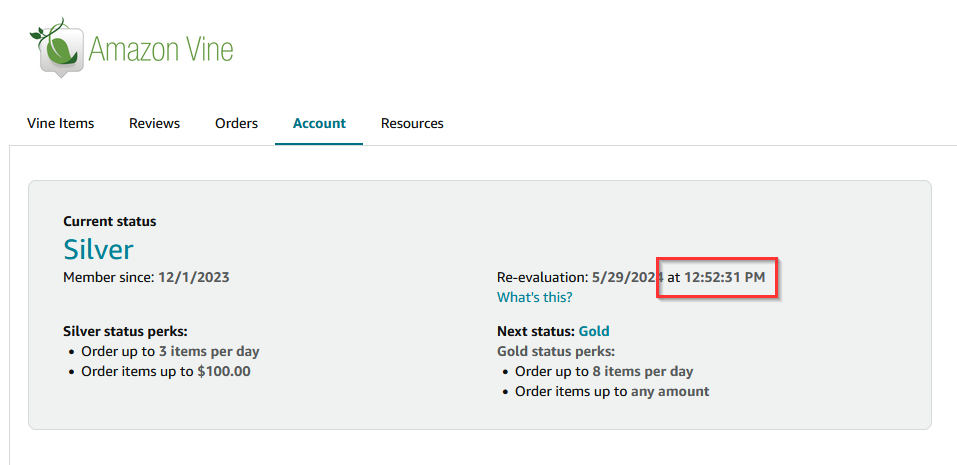
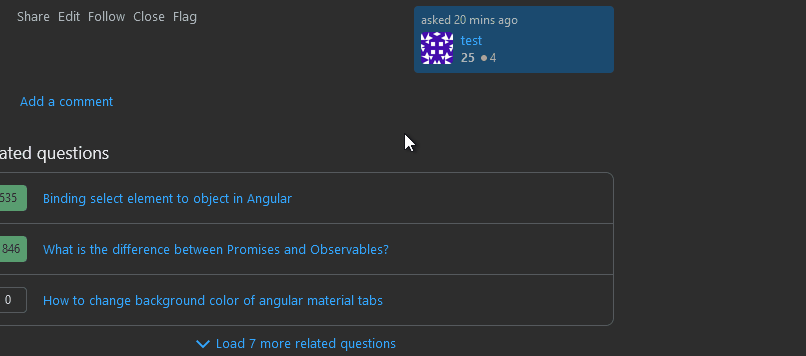
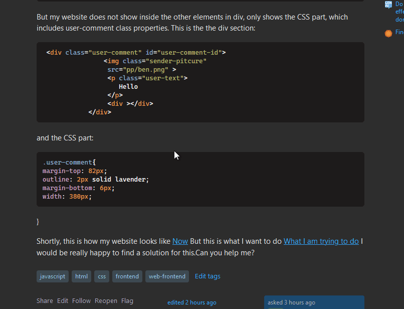

# UserScripts
A few Tampermonkey/Greasemonkey scripts I've made


# How to use
* Windows/Mac/Linux web browsers:
  1. Install the [Tampermonkey browser plugin](https://www.tampermonkey.net/) or [GreaseMonkey browser plugin](https://www.greasespot.net/)
  2. click one of the install links below


## Amazon Vine UI Enhancer
**[📜 Install Amazon Vine Enhancer Script](https://raw.githubusercontent.com/FiniteLooper/UserScripts/main/src/amazon-vine-enhancer.user.js)**
Minor UI improvements to using Amazon Vine:

* To install this on a web browser in Windows/Mac/Linux, follow the instructions above
* To install this on iOS:
  1. Install [Hyperweb](https://apps.apple.com/us/app/hyperweb/id1581824571)(App Store link)
  2. From this page press and hold on the **📜 Install Amazon Vine Enhancer Script** link above and choose **Copy Link**
  3. Open the Hyperweb app, go to the **Advanced** tab at the bottom then **Create Local Extension**
  4. Give it a name like "Amazon Vine"
  5. Press **New Condition** and then **Condition Type?** and select **URL matches RegEx**
  6. Enter `^https:\/\/www.amazon.com\/vine` as the value (if you are not from United States change the `.com` on the domain to match your country)
  7. Under the **Then** section tap **Add Action** and the **Action Type?** and select **Inject JS from URL**
  8. paste in the URL of the script you copied earlier

**Features**
* On all pages, adds a "close" button to any alert/message from vine. This will remember the last alert you've closed
* On the "Orders" page, a button is added on each item that shows all the info about it in an `alert` for easy copy/paste into a spreadsheet or something like that.
* On the "Account" page it will add the specific time that a reevaluation will occur on the reevaluation date
* On the "Vine Items" pages:
  * Adds a ⚙️ icon button for user-customizable settings for most everything below
  * Adds a 💵 button to just display the ETV inline without having to see the full details (helpful when comparing prices or searching for a 0ETV!)
  * Adds a 🔃 button to help fix products with the "infinite spinner" error
    * To use: click the product, copy the ASIN, and paste it after pressing this button. Not 100% effective, but works in some cases.
  * Sticky UI as you scroll:
    * The top bar
    * The pagination at the bottom
    * The categories side bar is stuck as you scroll, unless the categories are taller than your browser window
  * Pressing the left and right arrow keys on your keyboard will navigate to the previous and next pages of whatever you are viewing
  * The "see details" modal popup is made slightly larger so that the ETV is always visible for items with longer descriptions
  * Dims items with descriptions that match anything in an array defined at the top (example: hides "cake toppers")
  * Allows auto-refreshing a page on an interval (minimum 10 seconds) and highlights when the total item count changes from when the auto-refresh was started. This is per-page, so you can have multiple windows open each on a different page/URL with their own timers. This is only stored on a session so leaving Vine and returning later will not retain these settings
  * When performing a search:
    * The RFY/AFA/AI area buttons are normally hidden, this will restore them
    * Pressing the "show all" link will send you to the AI area instead of RFY
  * Plays nice with [Thorvarium's Vine Styling](https://github.com/Thorvarium/vine-styling) when installed via StyleBot
    * When using Thorvarium's "Small Items" styles on desktop or the mobile/iOS styles, the size of the items in the grid can be customized

Here's what the settings and most features look like


Here's what the alert hiding looks like




Here's what the added reevaluation time looks like




## Washington Post Paywall Remover
**[📜 Install Washington Post Paywall Remover Script](https://raw.githubusercontent.com/FiniteLooper/UserScripts/main/src/washington-post-paywall-remover.user.js)**

Exactly what you think it does. When you visit the Washington Post website it removes the paywall that blocks you from seeing the whole article. The full text of the article has already been downloaded, they just don't allow you to scroll down to read it. This removes those limitations.

## Job Search Highlighting
**[📜 Install Job Search Highlighting Script](https://raw.githubusercontent.com/FiniteLooper/UserScripts/main/src/job-search-highlighting.user.js)**

### Features
*  Highlight key words, locations, all mentions of money/currency, and your search terms if they are found within job descriptions
*  Optional list of flagged terms in certain categories can be added
*  Works on multiple websites:
   *  Job search sites: dice.com, glassdoor.com, indeed.com, honestjobs.com, linkedin.com, jobot.com, jobsfordevelopers.com, nowhiteboard.org, remote.co, remotejobs.com, remoteok.com startup.jobs, themuse.com, wellfound.com, workatastartup.com, workingnomads.com, and ziprecruiter.com
   *  Job application/recruitment sites used by many companies: applytojob.com, avature.net, dejobs.org, greenhouse.io, icims.com, jobs.lever.co, myworkdayjobs.com, roberthalf.com, smartmatchjobs.com, smartrecruiters.com, testedrecruits.com, and ultipro.com

#### Demo


#### Configuration
The key words that will be highlighted are split up into several categories, all of which are highlighted in different colors
| Property                     | Type       | Description                                                                                                                                 |
|:-----------------------------|:-----------|:--------------------------------------------------------------------------------------------------------------------------------------------|
| `flagSecurityClearances`     | `boolean`  | `true` by default - When `true` it will add words related to obtaining a security clearance to the list of flagged terms                    |
| `flagCriminalRecord`         | `boolean`  | `false` by default - When `true` it will add words related to a criminal history, or a background check to the list of flagged terms        |
| `descriptionAlwaysHighlight` | `string[]` | words to always highlight in **yellow** when found in a job description                                                                     |
| `descriptionAlwaysFlag`      | `string[]` | words to always highlight in **red** as "flagged" terms. Not necessarily bad things, but things to be sure you are aware of before applying |
| `workTypesAlwaysHighlight`   | `string[]` | words to always highlight in **purple** as the job type (full time, part time, W2, etc.)                                                    |
| `locationHighlightPattern`   | `RexExp`   | the location(s) of your choice. Defaults to anything remote or in the Charlotte, NC area (that's where I live, change it to your location!) |

For example, when looking for a remote position there are lots of jobs that say "remote from Los Angeles, CA". If you don't live in that city, even though it's remote it doesn't really apply to you. This allows you to highlight the location if it is simply "remote" (with no location) or you can specify things to look for in the location to highlight them for the locations you are interested in.
How to use

After installing you will need to edit the configuration variables described above to match whatever your preferences are.


## Stack Overflow Enhancer
**[📜 Install Stack Overflow Enhancer Script](https://raw.githubusercontent.com/FiniteLooper/UserScripts/main/src/stack-overflow-enhancer.user.js)**

### Features
*  Hides certain items in the right sidebar
*  Highlights/flags tags on a question if specific combinations are found
*  When viewing questions by tag, the current tags are highlighted
*  Dims questioned that have been marked as `[CLOSED]` or `[DUPLICATE]`
*  Allows easy indenting of code/text when editing a question or an answer (not within the snippet editor, just the plain question/answer editor)
*  Adds a button to the question/answer toolbar to convert all tab indentations to spaces
*  Adds "comment snippets" when adding a comment. Helpful if you find yourself re-writing the exact same comment many times (useful for moderating questions from new users)

#### Flagged Tag Combinations


#### Comment Snippets


#### Enhanced editor indenting


#### Configuration
| Property                         | Type         | Description                                                                                                  |
|:---------------------------------|:-------------|:-------------------------------------------------------------------------------------------------------------|
| `flagTagCombos`                  | `string[][]` | tags that when all are found in combination on a question they are highlighted in **red**. This is useful when moderating to improve question quality and searchability.  This might alert you that either one of these tags was likely added as a mistake, or that the question asker is using several things in combination that they probably should not be doing |
| `sidebarHideBlogs`               | `boolean`    | hides the yellow **"The Overflow Blog"** from the right sidebar                                              |
| `sidebarHideCollectives`         | `boolean`    | hides the **"Collectives"** from the right sidebar                                                           |
| `sidebarHideAds`                 | `boolean`    | hides the **ads** from the right sidebar                                                                     |
| `editorIndentSpaces`             | `number`     | number of spaces to use when indenting code.                                                                 |
| `commentSnippets`                | `object[]`   | Each comment snippet has a display `name` property and a `text` property which contains the actual comment   |

After installing you can edit the configuration variables described above to match whatever your preferences are.

## Autofill Lever Jobs EEO Information
**[📜 Install Autofill Lever Jobs Information Script](https://raw.githubusercontent.com/FiniteLooper/UserScripts/main/src/autofill-lever-information.user.js)**
A simple script that adds a button to the UI for Lever.co job applications, when pressed it auto-fills the dropdowns, etc. with whatever values you have specified


## Autofill MyWorkday Jobs Resume
**[📜 Install Autofill MyWorkday Jobs Resume Script](https://raw.githubusercontent.com/FiniteLooper/UserScripts/main/src/autofill-myworkdayjobs-resume.user.js)**

Applying for jobs via MyWorkday Jobs is cumbersome because many companies use them, but you have to create a new account for each company and re-enter your same resume for each company. It's the same website and yet they don't allow you to import a previously used resume.  This script allow you to store your resume in a JSON format and it puts some buttons in the UI at each step of the application. Just press the buttons and it will auto-fill your details for that step. It saves me a LOT of time if I am applying to many jobs.

Note that options in dropdown menus can change between companies, I guess they can provide their own values. A good example is your gender or ethnicity for the demographic data.
```
ethnicity: [
  "White",
  "White (Not Hispanic or Latino)",
  "White (United States of America)",
  "White (Not Hispanic or Latino) (United States of America)",
],
```
or the degree type for education
```
degreeType: [
  "Bachelor of Science (B.S.)",
  "Bachelors of Science",
  "Bachelor's of Science",
  "Bachelor of Science",
  "BS",
  "Bachelor's Degree",
  "Bachelors Degree",
  "Bachelor Degree",
  "Bachelors",
  "Bachelor",
],
```

The script will do it's best to find a match, and if multiples are found it will select which ever one is first in the provided array.
