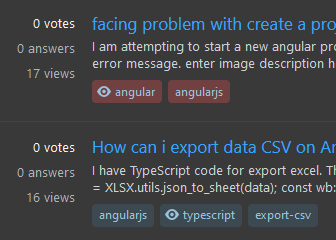

# UserScripts
A few Tampermonkey/Greasemonkey scripts I've made

# How to use
* Install the [Tampermonkey browser plugin](https://www.tampermonkey.net/) or [GreaseMonkey browser plugin](https://www.greasespot.net/)
* Navigate to one of the scripts either in the `/src/` folder and click the "RAW" button, or click one of the install links below

## Job Search Highlighting
**[📜 Install Job Search Highlighting Script](https://raw.githubusercontent.com/FiniteLooper/UserScripts/main/src/job-search-highlighting.user.js)**

### Features
*  Highlight key words, locations, all mentions of money/currency, and your search terms if they are found within job descriptions
*  Optional list of flagged terms in certain categories can be added
*  Works on multiple websites:
   *  Job search sites: dice.com, glassdoor.com, indeed.com, linkedin.com, jobot.com, jobsfordevelopers.com, remote.co, startup.jobs, and ziprecruiter.com
   *  Job application/recruitment sites used by many companies: applytojob.com, dejobs.org, greenhouse.io, jobs.lever.co, myworkdayjobs.com, testedrecruits.com, and ultipro.com

#### Demo

#### Configuration
The key words that will be highlighted are split up into several categories, all of which are highlighted in different colors
| Property                     | Type       | Description                                                                                                                                 |
|:-----------------------------|:-----------|:--------------------------------------------------------------------------------------------------------------------------------------------|
| `flagSecurityClearances`     | `boolean`  | `true` by default - When `true` it will add words related to obtaining a security clearance to the list of flagged terms                    |
| `flagCriminalRecord`         | `boolean`  | `false` by default - When `true` it will add words related to a criminal history, or a background check to the list of flagged terms        |
| `descriptionAlwaysHighlight` | `string[]` | words to always highlight in **yellow** when found in a job description                                                                     |
| `descriptionAlwaysFlag`      | `string[]` | words to always highlight in **red** as "flagged" terms. Not necessarily bad things, but things to be sure you are aware of before applying |
| `workTypesAlwaysHighlight`   | `string[]` | words to always highlight in **purple** as the job type (full time, part time, W2, etc.)                                                    |
| `locationHighlightPattern`   | `RexExp`   | the location(s) of your choice. Defaults to anything remote or in the Charlotte, NC area (that's where I live, change it to your location!) |

For example, when looking for a remote position there are lots of jobs that say "remote from Los Angeles, CA". If you don't live in that city, even though it's remote it doesn't really apply to you. This allows you to highlight the location if it is simply "remote" (with no location) or you can specify things to look for in the location to highlight them for the locations you are interested in.
How to use

After installing you will need to edit the configuration variables described above to match whatever your preferences are.

## Stack Overflow Enhancer
**[📜 Install Stack Overflow Enhancer Script](https://raw.githubusercontent.com/FiniteLooper/UserScripts/main/src/stack-overflow-enhancer.user.js)**

### Features
*  Hides certain items in the right sidebar
*  Highlights/flags tags on a question if specific combinations are found
*  When viewing questions by tag, the current tags are highlighted
*  Dims questioned that have been marked as `[CLOSED]` or `[DUPLICATE]`
*  Allows easy indenting of code/text when editing a question or an answer (not within the snippet editor, just the plain question/answer editor)
*  Adds a button to the question/answer toolbar to convert all tab indentations to spaces
*  Adds "comment snippets" when adding a comment. Helpful if you find yourself re-writing the exact same comment many times (useful for moderating questions from new users)

#### Flagged Tag Combinations

#### Comment Snippets

#### Enhanced editor indenting

#### Configuration
| Property                         | Type         | Description                                                                                                  |
|:---------------------------------|:-------------|:-------------------------------------------------------------------------------------------------------------|
| `flagTagCombos`                  | `string[][]` | tags that when all are found in combination on a question they are highlighted in **red**. This is useful when moderating to improve question quality and searchability.  This might alert you that either one of these tags was likely added as a mistake, or that the question asker is using several things in combination that they probably should not be doing |
| `sidebarHideBlogs`               | `boolean`    | hides the yellow **"The Overflow Blog"** from the right sidebar                                              |
| `sidebarHideCollectives`         | `boolean`    | hides the **"Collectives"** from the right sidebar                                                           |
| `sidebarHideAds`                 | `boolean`    | hides the **ads** from the right sidebar                                                                     |
| `sidebarHideHotNetworkQuestions` | `boolean`    | hides the **"Hot Network Questions"** from the right sidebar                                                 |
| `editorIndentSpaces`             | `number`     | number of spaces to use when indenting code.                                                                 |
| `commentSnippets`                | `object[]`   | Each comment snippet has a display `name` property and a `text` property which contains the actual comment   |

After installing you can edit the configuration variables described above to match whatever your preferences are.

